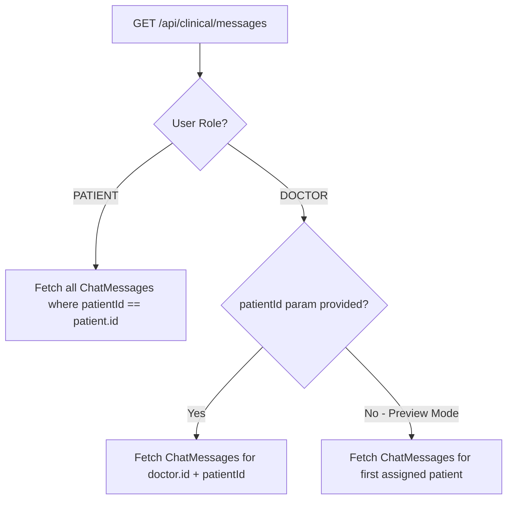

# Design Document: Bulletproof Telehealth Messaging Sync Fix

## Root Cause Analysis Summary
Through empirical log & code investigation, 3 specific bugs caused message sync failures:

1. **Clinician Preview Mode API Mismatch:** When a Doctor clicked **"Patient Preview"**, `user.role` remained `"DOCTOR"` on the server. `Dashboard()` called `GET /api/clinical/messages` without a `patientId` query parameter. The server saw `role === "DOCTOR"` without `patientId` and returned `{ patients: [...], messages: [] }`, causing 0 messages to display in Patient Preview.
2. **Missing Dynamic Patient List Polling on Clinician Dashboard:** `ClinicianDashboard` fetched assigned patients only once at page mount. When a patient created an account or sent an initial message, the doctor's patient thread list didn't auto-update, leaving `selectedPatientId` unpopulated or set to another patient.
3. **Rigid `doctorId` Query Filter on Patient Side:** Patients queried `where: { patientId, doctorId }`. If `CareAssignment` pointed to a different Doctor ID than the sender, messages were silently excluded.

## System Architecture & Fix Plan

## Solution Specifications

### 1. Robust `GET /api/clinical/messages` Endpoint (`src/app/api/clinical/messages/route.ts`)
- **For `PATIENT` Role:**
  - Auto-upserts `Patient` profile for `user.id`.
  - Queries `ChatMessage` where `patientId === patient.id`, returning **all** messages in chronological order.
  - Automatically marks messages from `DOCTOR` as `isRead: true`.
- **For `DOCTOR` Role:**
  - If `queryPatientId` is provided: Queries messages where `patientId === queryPatientId` and `doctorId === doctor.id`. Marks messages from `PATIENT` as `isRead: true`.
  - If `queryPatientId` is NOT provided (e.g. Patient Preview Mode or main poll):
    - Automatically finds doctor's first assigned patient or demo patient.
    - If found: Returns `messages` for that patient AND the `patients` list with unread counts.

### 2. Robust `POST /api/clinical/messages` Endpoint (`src/app/api/clinical/messages/route.ts`)
- **When Doctor sends a message:**
  - Upserts `CareAssignment` for `(doctorId, patientId)`.
  - Creates `ChatMessage` with `senderRole: "DOCTOR"`.
- **When Patient sends a message:**
  - If no `CareAssignment` exists, auto-assigns to the first Doctor in DB.
  - Creates `ChatMessage` with `senderRole: "PATIENT"`.

### 3. Clinician Dashboard Patient Thread Auto-Sync (`src/features/clinical/clinician-dashboard.tsx`)
- When `fetchMessages()` runs, if `data.patients` is returned, updates the `patients` list with unread badges.
- If `selectedPatientId` is not set yet, automatically selects `data.patients[0].id`.
