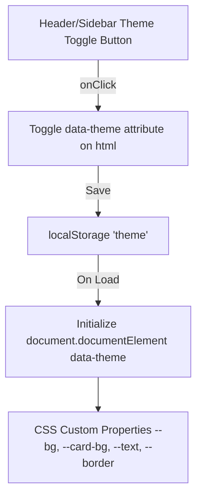

# Design Document: Premium Dark Mode Feature

## Overview
This document specifies the design for Dark Mode in GlucoLink, supporting light and dark theme switching across both the Patient and Clinician workspaces.

## System Architecture

## CSS Theme Tokens (`src/app/globals.css` & `src/app/clinical.css`)

### Light Theme Default (`:root`)
- `--bg-main`: `#f7f9f8`
- `--sidebar-bg`: `#ffffff`
- `--card-bg`: `#ffffff`
- `--text-main`: `#182521`
- `--text-muted`: `#78847f`
- `--border-color`: `#e9efec`

### Dark Theme (`[data-theme="dark"]`)
- `--bg-main`: `#0b1411`
- `--sidebar-bg`: `#101c18`
- `--card-bg`: `#14231e`
- `--text-main`: `#f3f4f6`
- `--text-muted`: `#9ca3af`
- `--border-color`: `#1f332b`

### Clinician Dark Theme (`.clinical-shell[data-theme="dark"]` / `[data-theme="dark"]`)
- `--clinical-bg`: `#090d16`
- `--clinical-sidebar-bg`: `#0f172a`
- `--clinical-card-bg`: `#111827`
- `--clinical-text`: `#f8fafc`
- `--clinical-border`: `#1e293b`

## Components & State Management

### 1. Theme Toggle Hook / Component (`src/components/theme-toggle.tsx`)
- Reads initial theme from `localStorage.getItem("theme")` or `matchMedia("(prefers-color-scheme: dark)")`.
- Updates `document.documentElement.setAttribute("data-theme", theme)`.
- Renders a 🌙 / ☀️ button with smooth hover animation.

### 2. Patient Dashboard (`src/features/dashboard/dashboard.tsx`)
- Includes `<ThemeToggle />` in the `
`.

### 3. Clinician Dashboard (`src/features/clinical/clinician-dashboard.tsx`)
- Includes `<ThemeToggle />` in `
`.
