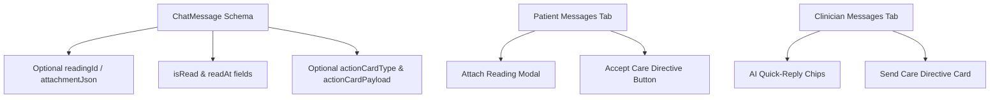

# Design Document: Telehealth Messaging System Overhaul

## Overview
This document specifies the design for a complete overhaul of GlucoLink's messaging platform, introducing rich glucose attachments, unread message badges, read receipts, AI clinical quick-replies, and interactive in-chat Care Plan adjustment cards.

## System Architecture & Schema Updates



### Prisma Schema Updates (`prisma/schema.prisma`)
Add fields to `ChatMessage`:
```prisma
model ChatMessage {
  id               String    @id @default(cuid())
  patientId        String
  doctorId         String
  senderId         String
  senderRole       String    // "PATIENT" | "DOCTOR"
  content          String
  readingId        String?
  reading          Reading?  @relation(fields: [readingId], references: [id], onDelete: SetNull)
  attachmentJson   String?   // JSON string for glucose attachments or care directives
  isRead           Boolean   @default(false)
  readAt           DateTime?
  createdAt        DateTime  @default(now())
  doctor           Doctor    @relation(fields: [doctorId], references: [id], onDelete: Cascade)
  patient          Patient   @relation(fields: [patientId], references: [id], onDelete: Cascade)

  @@index([patientId, doctorId, createdAt])
}
```

## Functional Specifications

### 1. Read Receipts & Unread Message Badges
- **`GET /api/clinical/messages`**: Marks messages as read (`isRead: true, readAt: new Date()`) when requested by the recipient. Returns `unreadCount`.
- **Sidebar & Tab Badges**: Displays red pill badges on the Messages sidebar tab in both Patient and Clinician dashboards.

### 2. Glucose Reading Attachments & Attach Modal
- **Attach Reading Action**: Inside the chat input bar, add a `📎 Attach Glucose` button.
- Opens a selector with recent glucose readings (e.g., `245 mg/dL - Critical High - 10:15 AM`).
- Renders attached readings inside a custom glassmorphism card within the message bubble.

### 3. AI Clinical Quick-Replies for Doctors
- Above the clinician chat input, display AI-suggested response chips based on recent patient trends (e.g., *"I noticed your post-lunch high of 245 mg/dL. Did you take your prescribed Metformin?"*).
- Clicking a chip fills the input box for 1-tap sending.

### 4. Interactive Care Directive Cards
- **Doctor Action**: Clinicians can send an official Care Directive card (e.g. *"Increase Evening Metformin to 1000 mg"*).
- **Patient Action**: Renders an in-chat **"Accept & Update Care Plan"** button. Clicking updates the patient's active medication state directly.
