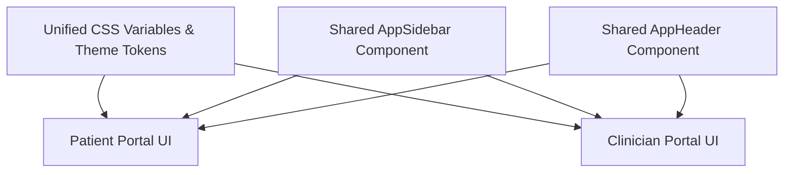

# Design Document: Cohesive Portal UI Overhaul & Navigation System

## Problem Definition
The Patient Portal (`/`) and Clinician Portal (`/clinician`) currently feature contrasting visual designs and hardcoded inline styles.
- **Patient Portal:** Light teal/emerald theme with glassmorphic cards and rounded pills.
- **Clinician Portal:** Hardcoded dark slate (`#111`, `#1a1a1a`) inline styles that bypass the theme toggle and break light/dark mode persistence.
- **Navigation Disconnect:** Different sidebars, headers, search bars, and card components make switching between portals feel like opening two entirely separate products.

---

## Unified Design Architecture

---

## Key Design Overhauls

### 1. Unified Design Token System (`src/app/globals.css`)
- Establishes a single source of truth for color palettes, typography, spacing, and shadows in both Light & Dark modes:
  - `--bg-app`: Background for main content area (`#f8faf9` / `#0f1715`).
  - `--bg-card`: Card background (`#ffffff` / `#162520`).
  - `--bg-sidebar`: Navigation sidebar background (`#ffffff` / `#121e1a`).
  - `--accent-emerald`: Core brand accent (`#059669` / `#10b981`).
  - `--border-color`: Smooth subtle borders (`#e2e8f0` / `#1f312b`).
- Banish hardcoded inline styles (`background: "#111"`) across the Clinician dashboard so Dark Mode and Light Mode work seamlessly and identically everywhere!

### 2. Reusable Layout Shell Components
- **`AppSidebar` (`src/components/app-sidebar.tsx`):**
  - Consistent GlucoLink brand header (`G GlucoLink`).
  - Active tab highlighting with smooth green pill accents and clean SVG/unicode icons.
  - Role indicator badge (`👤 Patient Workspace` vs `🩺 Clinician Panel`).
  - 1-Click Workspace Quick-Switch button at the bottom.
- **`AppHeader` (`src/components/app-header.tsx`):**
  - Standardized page title & breadcrumbs.
  - Universal Search Bar (searches readings or patients).
  - Quick action buttons (Log Reading / Add Patient).
  - Theme Toggle + Notification Bell Badge + Profile Menu dropdown.

### 3. Cohesive Component Styles
- Refactor both `dashboard.tsx` and `clinician-dashboard.tsx` to use unified CSS classes:
  - `.gl-card` / `.gl-stat-card` for all metric and summary cards.
  - `.gl-badge` for risk status (Urgent, Review, Stable).
  - `.gl-table` for reading history and patient tables.
  - `.gl-button-primary` / `.gl-button-secondary` for all primary/secondary actions.
