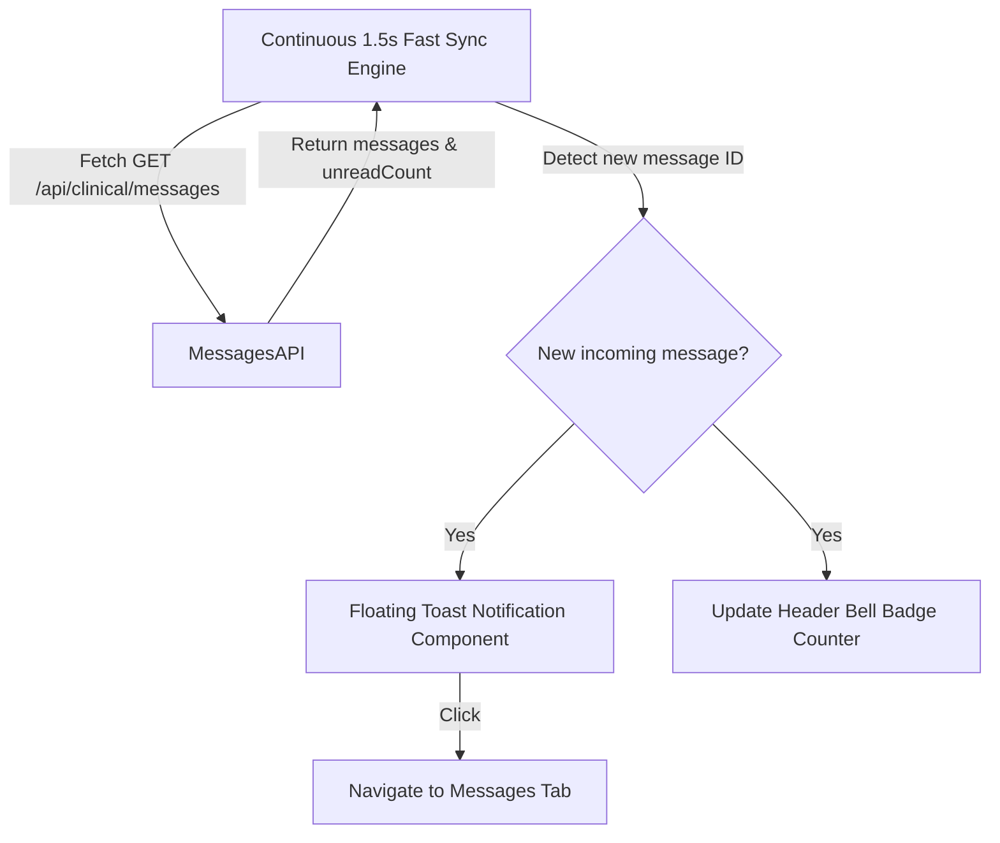

# Design Document: Real-Time Messaging Sync & Toast Notification System

## Overview
This document specifies the design for fixing real-time background message sync and adding an in-app Floating Toast Notification system and header bell unread counter badge.

## System Architecture

## Functional Specifications

### 1. Continuous Fast Sync Engine (`src/features/dashboard/dashboard.tsx` & `src/features/clinical/clinician-dashboard.tsx`)
- Removes conditional `activeTab === "messages"` requirement for polling.
- Runs `fetchMessages()` every **1500ms** continuously.
- Compares previous message list length & latest message ID.
- If a message with `senderRole !== currentUserRole` is newly detected:
  - Sets `activeToast` state.
  - Updates `unreadCount` badge in sidebar navigation and header bell.

### 2. Floating Toast Notification Banner (`src/components/notification-toast.tsx`)
- Floating card rendered at top-right of screen (`z-index: 200`).
- Displays sender icon, title (*"New Message from Care Team"* or *"New Message from Patient"*), and message snippet.
- Includes a **"View Message →"** button that switches `activeTab` to `"messages"`.
- Dismisses automatically after 5 seconds or on manual close (`×`).

### 3. Header Bell Notification Integration
- Connects header bell icon button (`♧`) to live `unreadCount`.
- Displays red notification dot / badge when `unreadCount > 0`.
- Clicking bell opens messages tab or toast list.
