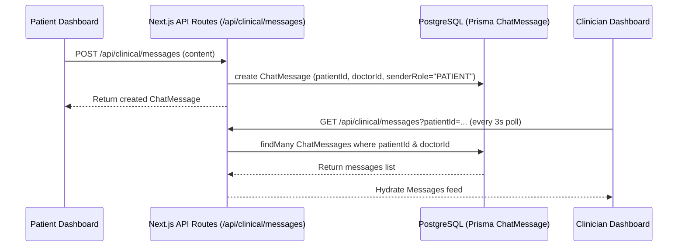

# Design Document: Database-Backed Synced Messaging

## Overview
This document specifies the design for a persistent, database-backed messaging feature connecting patients with their assigned care providers in GlucoLink.

## System Architecture



## Data Schema (`prisma/schema.prisma`)

```prisma
model ChatMessage {
  id         String   @id @default(cuid())
  patientId  String
  patient    Patient  @relation(fields: [patientId], references: [id], onDelete: Cascade)
  doctorId   String
  doctor     Doctor   @relation(fields: [doctorId], references: [id], onDelete: Cascade)
  senderId   String
  senderRole String   // "PATIENT" | "DOCTOR"
  content    String
  createdAt  DateTime @default(now())

  @@index([patientId, doctorId, createdAt])
}
```

## API Endpoints

### 1. `GET /api/clinical/messages`
- **Query Params:** `patientId` (required for doctor, optional for patient)
- **Authorization:**
  - If requested by a Patient: verifies patient identity and auto-resolves their assigned doctor from `CareAssignment`.
  - If requested by a Doctor: verifies doctor identity and ensures a valid `CareAssignment` exists for `patientId`.
- **Response:** `{ messages: Array<ChatMessage>, doctor: DoctorInfo, patient: PatientInfo }`

### 2. `POST /api/clinical/messages`
- **Body:** `{ patientId?: string, content: string }`
- **Authorization:**
  - Patient sending message: attaches `senderRole="PATIENT"` and `doctorId` from `CareAssignment`.
  - Doctor sending message: attaches `senderRole="DOCTOR"` and validates `CareAssignment` for `patientId`.
- **Response:** `{ message: ChatMessage }`

## Frontend UI Components

### 1. Patient Dashboard Messages Tab (`src/features/dashboard/dashboard.tsx`)
- Fetches messages from `GET /api/clinical/messages`.
- Automatically polls every 3 seconds while active tab is `"messages"`.
- Message composer sends content via `POST /api/clinical/messages` and appends to UI state immediately.

### 2. Clinician Dashboard Messages Tab (`src/features/clinical/clinician-dashboard.tsx`)
- Lists all assigned patients on the left sidebar.
- Selecting a patient loads their specific chat thread from `GET /api/clinical/messages?patientId=...`.
- Automatically polls every 3 seconds while active tab is `"messages"`.
- Message composer sends content via `POST /api/clinical/messages` targeting `selectedPatientId`.

## Security & Governance
- Strictly enforced via `src/lib/access.ts` (`requirePatient`, `requireDoctor`, `requireAssignedPatient`).
- Unassigned doctors cannot view or intercept another doctor's patient chat messages.
- Audit logs created on message send events (`CREATE_CHAT_MESSAGE`).
